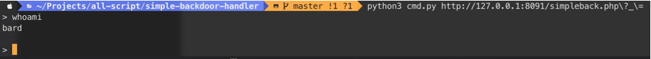

# Simple Backdoor Handler

a simple backdoor handler, so you can enter your payload easier.

usage : 
```
python cmd.py [URL]
#the parameter has to be included in [URL] like : http://target.site/my/backdoor.php?cmd=
```
Screenshot
